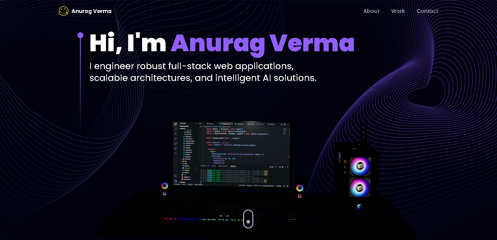

# Anurag Verma | Full-Stack Software Engineer Portfolio



A modern, fully responsive 3D portfolio showcasing my expertise as a Full-Stack Software Engineer. Built with React.js, Three.js, and Tailwind CSS, featuring interactive 3D graphics, smooth animations, and real-world project demonstrations.

**Live Demo:** [anurag-verma-portfolio.vercel.app](https://portfolio-anurag-verma.vercel.app/)

## 🎯 Featured Work

- **AI Short Video Ads Generator** - AI-powered platform for generating high-quality short video advertisements with customizable outputs
- **Video Calling Interview Platform** - Real-time interview platform with WebRTC video calling, live code editor, and automated evaluation
- **Payment Processing System** - Production-grade payment gateway inspired by Razorpay with idempotent transactions and webhook simulation
- **Social Media Platform** - Full-stack MERN platform with AI-powered post generation and real-time interactions
- **Ecommerce Tech Store** - Complete tech e-commerce solution with React, Node.js, and MongoDB

## 💻 Tech Stack

**Frontend:** React.js, TypeScript, Tailwind CSS, Three.js, Framer Motion, React Three Fiber

**Backend:** Node.js, Express.js

**Database:** MongoDB

**Real-time:** WebRTC, Socket.io

**DevOps & Tools:** Git, Docker, Vite, Vercel

## 🚀 Quick Start

### Prerequisites
- Node.js 16+ ([Download](https://nodejs.org/en/))
- Git ([Download](https://git-scm.com/downloads))

### Setup

1. **Clone the repository:**
   ```bash
   git clone https://github.com/anuragverma4895/3D-Portofolio.git
   cd 3D-Portofolio
   ```

2. **Install dependencies:**
   ```bash
   npm install
   ```

3. **Setup environment variables** (`.env`):
   ```env
   VITE_APP_EMAILJS_SERVICE_ID=<YOUR_SERVICE_ID>
   VITE_APP_EMAILJS_TEMPLATE_ID=<YOUR_TEMPLATE_ID>
   VITE_APP_EMAILJS_PUBLIC_KEY=<YOUR_PUBLIC_KEY>
   ```

4. **Start development server:**
   ```bash
   npm run dev
   ```

5. **Open** [http://localhost:5173](http://localhost:5173) in your browser

## 📦 Available Scripts

- `npm run dev` - Start development server
- `npm run build` - Build for production
- `npm run preview` - Preview production build
- `npm run ts:check` - Type check the project

## ✉️ Contact

- **Email:** anuragverma4895@gmail.com
- **GitHub:** [@anuragverma4895](https://github.com/anuragverma4895)

---

*Engineering scalable, user-centric solutions that solve real-world problems.*
